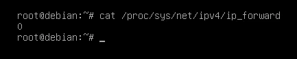
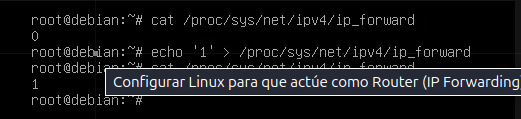
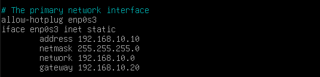
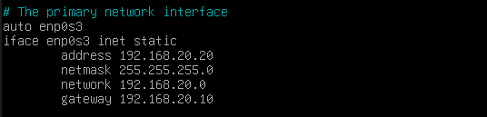
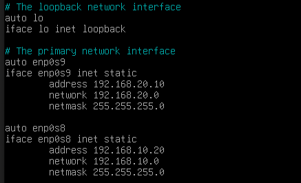
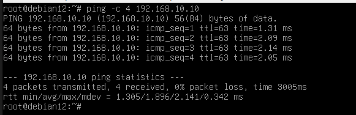

# IP-Forwarding
## Configurar Linux para que actúe como Router

Podemos configurar un Linux Debian como router de forma bastante sencilla. La idea es comprobar si en la máquina Linux que usaremos como router, está el IP Forwarding activado, que es lo que permite el reenvío de paquetes. Por defecto, esta configuración estará desactivada.

Para este post estaremos usando las siguientes máquinas(Todas son Debian):

3 Equipos:

    CLiente  –> Mi equipo de atacante

    IP: 192.168.10.10
    Red: 192.168.10.0

    Relay –> Actuará como Router

    –> 2 Interfaces de Red
    Server 

    IP: 192.168.10.20 y 192.168.20.10 

    –> Servidor 

    IP: 192.168.20.20
     Red: 192.168.20.0

    

### Cliente

Para comprobar que el IP Forwarding esté activado, tendremos que mirar el contenido del archivo `/proc/sys/net/ipv4/ip_forward`

Si está desactivado, el contenido será 0, por lo que, si queremos activarlo, tendremos que modificar su contenido a 1:
 `echo '1' > /proc/sys/net/ipv4/ip_forwar`

Ahora configuramos la red del cliente segun el rango de ip indicado en la foto del esquema de red, la configuración se realizara en el siguiente fichero:
 
`sudo nano /etc/network/interfaces`

Teniendo el forwarding activado y la configuración de ip  en el cliente,solo queda agregar el enrutamiento estático.

Podemos ver las rutas estáticas con el siguiente comando:
`ip route`

Podemos agregar y eliminar rutas estáticas a nuestro antojo con los siguientes comandos (con permisos de root):

- Agregar rutas estáticas:
`ip route add <ip de red a llegar>/<mascara de red en CIDR> via <ip del router> dev <interfaz a usar> `

- Eliminar rutas estáticas:
`ip route delete <ip de red a llegar>/<mascara de red en CIDR> via <ip del router> dev <interfaz a usar>`

De esta forma, en este caso, las rutas a agregar al Cliente serían las siguientes:

`ip route add 192.168.20.0/24 via 192.168.10.20 dev eth1`

### Server

Para comprobar que el IP Forwarding esté activado, tendremos que mirar el contenido del archivo `/proc/sys/net/ipv4/ip_forward`

Si está desactivado, el contenido será 0, por lo que, si queremos activarlo, tendremos que modificar su contenido a 1:
 `echo '1' > /proc/sys/net/ipv4/ip_forwar`

Ahora configuramos la red del server según el rango de ip indicado en la foto del esquema de red, la configuración se realizara en el siguiente fichero:
 
`sudo nano /etc/network/interfaces`

Teniendo el forwarding activado en el server y la red configurada ,solo queda agregar el enrutamiento estático.

Podemos ver las rutas estáticas con el siguiente comando:
`ip route`

Podemos agregar y eliminar rutas estáticas a nuestro antojo con los siguientes comandos (con permisos de root):

- Agregar rutas estáticas:
`ip route add <ip de red a llegar>/<mascara de red en CIDR> via <ip del router> dev <interfaz a usar> `

- Eliminar rutas estáticas:
`ip route delete <ip de red a llegar>/<mascara de red en CIDR> via <ip del router> dev <interfaz a usar>`

De esta forma, en este caso, las rutas a agregar al Cliente serían las siguientes:

`ip route add 192.168.10.0/24 via 192.168.20.10 dev enp0s3`

### Relay

Para comprobar que el IP Forwarding esté activado, tendremos que mirar el contenido del archivo `/proc/sys/net/ipv4/ip_forward`

Si está desactivado, el contenido será 0, por lo que, si queremos activarlo, tendremos que modificar su contenido a 1:
 `echo '1' > /proc/sys/net/ipv4/ip_forwar`

Teniendo el forwarding activado en el relay ,solo queda agregar las configuraciones de red del cliente y el server, esto lo aremos desde el siguiente fichero de configuración:

`sudo nano /etc/network/interfaces`

Teniendo el IP Forwarding ya activado en el Relay y las rutas estáticas tanto en el Cliente como en el Server, ya podemos comunicarnos entre estos dos dispositivos sin ningún tipo de problema mediante el comando:
 *Para que se puedan comunicar tienen que estar todas las maquinas **encendidas** a la vez*

`ping <red a la cula nos queremos comunicar >`

